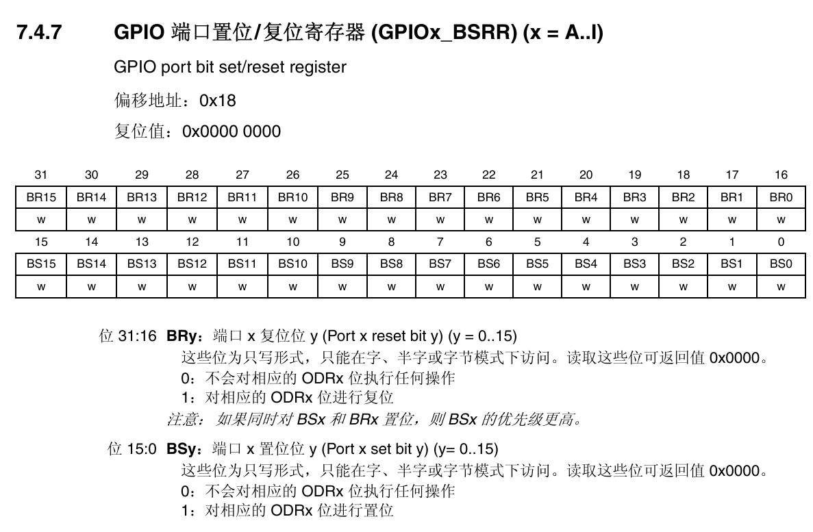
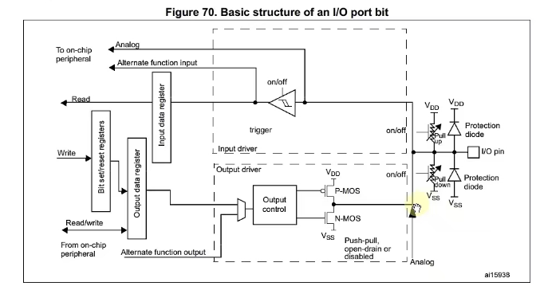
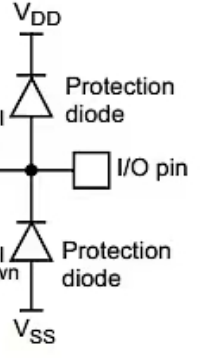

# GPIO 
##  简介：
gpio 一个通用I/O端口有10个寄存器，且都为32位，

### 简介引申：常用寄存器的介绍
#### 端口模式寄存器（`MODER`）
用于配置每个 **IO引脚的工作模式**。

---

1. **位宽结构**：
   - `MODER` 是一个 **32位寄存器**。
   - 每个 GPIO 端口（如 `GPIOA`, `GPIOB` 等）有 16 个引脚（例如 PA0 ~ PA15）。
   - 每个引脚使用 **2位** 来配置其模式，因此总共需要 `16 × 2 = 32位`。


2. **配置方式**：
   - 每个引脚对应的两个位可以设置为以下值：
     | 二进制值 | 模式                  |
     |----------|-----------------------|
     | 00       | 输入模式              |
     | 01       | 输出模式              |
     | 10       | 复用功能模式          |
     | 11       | 模拟模式              |

3. **示例：配置 PA5 为输出模式**
```c
// 先要PA5清除原有配置（因为每个引脚占 2 位，所以第 5 个引脚从第 `5 × 2 = 10` 位开始。0x3 << (5 * 2)：变成 0xC00（二进制 `1100 0000 0000`）。再按位取反，得到0xFFFFF3FF，除了第 10、11 位外其余都为 1。&=后：第十、十一位变成0，其他不变）
GPIOA->MODER &= ~(0x3 << (5 * 2));  // 清除原有配置
// 设置为输出模式（二进制值为01）(第10和11位此时已经是00了，或什么得到的就是什么)
GPIOA->MODER |= (0x1 << (5 * 2));   
```
---


#### 端口输出类型寄存器 (`OTYPER`)
主要决定是推挽还是开漏输出


---
1. **位宽结构**：
   - `OTYPER` 是一个 **32位寄存器**。
   - 每个 GPIO 引脚占用 **1位**（共支持最多 16 个引脚）

2. **作用**：
   - 控制每个引脚的 **输出电路结构类型**。
   - 影响引脚在输出模式下的电气特性和驱动能力。

3. **配置方式**：
   - 每个引脚对应一位（bit）：
     | 值 | 输出类型       
     |----|----------------
     | 0  | 推挽输出（PP） 
     | 1  | 开漏输出（OD） 

4. **示例：将 PA5 配置为开漏输出**
   ```c
   // 设置为开漏输出
   GPIOA->OTYPER |= (1 << 5);
   // 设置为推挽输出
   GPIOA->OTYPER &= ~(1 << 5);
   ```
---


####  输出速度寄存器(OSPEEDR) ：

用于配置每个 GPIO 引脚在输出模式下的 **驱动速度等级（Slew Rate）**

---

1. **位宽结构**
- `OSPEEDR` 是一个 **32位寄存器**。
- 每个 GPIO 引脚占用 **2位** 来设置速度等级。
- 支持最多 16 个引脚（如 PA0 ~ PA15），总共需要 `16 × 2 = 32位`。

2. **作用**
- 控制引脚输出信号的 **上升/下降时间（slew rate）**。
- 高速模式下，IO 反应更快，但可能带来更高的功耗和电磁干扰。
- 低速模式下，功耗更低、更稳定，适合低频外设（如按键、LED、I2C 等）。

3. **配置方式**

| 二进制值 | 速度等级         | 描述                           |
|----------|------------------|--------------------------------|
| 00       | Very Low Speed   | 极低速，适用于低频或远距离通信 |
| 01       | Low Speed        | 低速                            |
| 10       | High Speed       | 高速                            |
| 11       | Very High Speed  | 极高速，适合高速外设（如SPI）  |

4. **示例：将 PA5 设置为中速输出**
```c
// 清除 PA5 的原有速度配置
GPIOA->OSPEEDR &= ~(0x3 << (5 * 2));  
// 设置为中速输出
GPIOA->OSPEEDR |= (0x2 << (5 * 2));
```

---


- **低功耗场景**（如 LED 控制）：选择 `Very Low` 或 `Low`。
- **高速通信**（如 SPI、FSMC）：选择 `High` 或 `Very High`。
- **减少 EMI**：避免不必要的高速配置，尤其是在布线较长或对干扰敏感的设计中。


---

#### 上拉下拉寄存器（ PUPDR ）


---

1. **位宽结构**
- `PUPDR` 是一个 **32位寄存器**。
- 每个 GPIO 引脚占用 **2位** 来设置其上下拉状态。
- 支持最多 16 个引脚（如 PA0 ~ PA15），总共需要 `16 × 2 = 32位`。

2. **作用**
- 控制每个引脚是否启用 **内部上拉电阻** 或 **下拉电阻**。
- 在输入模式下，防止引脚悬空（floating），提高稳定性。
- 在开漏输出模式下，配合外部上拉实现逻辑高电平。

3. **配置方式**
每个引脚对应的两位可设置为以下值（以 STM32F4 系列为例）：

| 二进制值 | 配置类型        | 描述                           |
|----------|------------------|--------------------------------|
| 00       | No Pull-up/Pull-down | 无上下拉（默认状态）         |
| 01       | Pull-up          | 启用内部上拉电阻               |
| 10       | Pull-down        | 启用内部下拉电阻               |
| 11       | Reserved         | 保留，不能使用                 |

---

4. 将 PA5 设置为上拉输入

```c
// 设置为输入模式
GPIOA->MODER &= ~(0x3 << (5 * 2));  // 清除原有配置
GPIOA->MODER |= (0x00 << (5 * 2));  // 输入模式

// 设置为上拉
GPIOA->PUPDR &= ~(0x3 << (5 * 2));  // 清除原有配置
GPIOA->PUPDR |= (0x01 << (5 * 2));  // 上拉
```


---

5. 使用场景建议

| 场景                    | 推荐配置     | 说明                                      |
|-------------------------|--------------|-------------------------------------------|
| 按键检测（低电平有效）   | 上拉         | 按键未按下时为高电平，按下接地变为低电平    |
| 总线通信（如 I2C）       | 上拉         | 开漏输出需外部/内部上拉才能输出高电平       |
| 复位信号输入             | 下拉         | 默认低电平有效，避免干扰导致误复位          |
| 悬空引脚（不影响系统）   | 无上下拉     | 减少功耗                                  |


---

#### 输入数据寄存器（IDR）：
用于读取 GPIO 引脚当前的 **输入电平状态**（高电平或低电平）。


1. **位宽结构**
- `IDR` 是一个 **32位只读寄存器**。
- 每个 GPIO 引脚对应 1 位（bit）。
- 低 16 位（bit 0 ~ bit 15）代表该端口的 16 个引脚（如 PA0 ~ PA15），高 16 位保留。

2. **作用**
- 实时反映每个引脚的 **外部输入电平状态**。
- 常用于检测按键、开关、传感器等外部信号。
- 只读，不能通过写操作改变其值。

3. **配置前提**
要使用 `IDR` 读取某个引脚的状态，需确保：
- 引脚已配置为 **输入模式（MODER[x: x+1] = 00）**
- 上下拉电阻根据需要配置（PUPDR）

4.  示例：读取 PA5 的输入电平

```c
// 1. 设置为输入模式
GPIOA->MODER &= ~(0x3 << (5 * 2));  // 清除原有配置
GPIOA->MODER |= (0x00 << (5 * 2));  // 输入模式

// 2. 设置上拉（可选）
GPIOA->PUPDR &= ~(0x3 << (5 * 2));  // 清除原有配置
GPIOA->PUPDR |= (0x01 << (5 * 2));  // 上拉

// 3. 读取输入状态
if ((GPIOA->IDR & (1 << 5)) != 0) {
    // 高电平
} else {
    // 低电平
}
```

- `(1 << 5)`：构造掩码，仅关注第 5 位。
- `GPIOA->IDR & (1 << 5)`：判断该位是否为 1。
- 若结果不等于 0，则表示该引脚为高电平。

---

5. 典型应用场景

| 场景         | 描述 |
|--------------|------|
| 按键检测     | 将按键一端接地，另一端接 PA0，通过 `GPIOA->IDR & (1 << 0)` 检测按键是否按下。 |
| 外部中断触发前检测 | 在进入中断前先读 IDR 确认当前电平，防止误触发。 |
| 数字信号采集 | 读取来自其他数字设备的高低电平信号，如传感器输出、编码器信号等。 |

---

6. 注意事项

- **只能读取输入引脚的状态**，若引脚被配置为输出模式，读取到的是 **输出寄存器 ODR 的值**，而非实际输入电平。
- 不建议频繁轮询 `IDR`，应结合中断机制提高效率（如 EXTI 中断）。
- 读取前可加入延时或去抖动处理（尤其用于按键检测）。

---
##### 扩展：施密特触发器

- 施密特触发器是一种具有 **迟滞特性** 的比较器电路。
- 在 GPIO 输入路径中使用它，可以提高抗干扰能力，防止由于噪声导致的误判。
- 特点：
  - 有两个阈值电压：一个用于上升沿检测，一个用于下降沿检测。
  - 当输入电压从低向高变化时，必须超过较高阈值才会被认为是高电平；反之亦然。

>  在 STM32 等 MCU 的 GPIO 结构中，施密特触发器是输入路径的一部分，用于将模拟信号转化为干净的数字信号供内部逻辑使用。

---

##### TTL 和 CMOS

| 类型 | 全称 | 工作电压 | 阈值特点 | 应用场景 |逻辑高电平标准|逻辑低电平标准
|------|------|----------|-----------|----------|----------|----------|
| TTL  | Transistor-Transistor Logic | 通常为 5V | 固定阈值（约 1.4V） | 早期数字电路 |>=2v|<=0.8V
| CMOS | Complementary Metal-Oxide-Semiconductor | 可变（如 3.3V、5V） | 阈值与电源电压相关（约为 VDD/2） | 现代低功耗芯片 |>=2.31V|<=0.99v

- MCU 的 GPIO 接口通常兼容 **CMOS 电平标准**。

---


#### Output Data Register（ODR）


1.  **位宽结构**
- `ODR` 是一个 **32位寄存器**，每个 GPIO 端口都有一个。
- 每一位（bit）对应一个引脚（如 PA0 ~ PA15），高 16 位保留不用。

2. **作用**
- 用于设置某个引脚的 **输出电平状态**：
  - 写入 `1`：引脚输出 **高电平**
  - 写入 `0`：引脚输出 **低电平**
---

3. **使用方式**

```c
// 设置 PA5 为高电平
GPIOA->ODR |= (1 << 5);
// 设置 PA5 为低电平
GPIOA->ODR &= ~(1 << 5);
```

---

3. 注意事项

| 项目 | 说明 |
|------|------|
| 需要提前配置引脚为输出模式 | MODER[x: x+1] = 01 |
| 如果引脚被配置为输入模式 | ODR 的值不会影响实际电平，应读取 IDR |
| 不适用于快速切换电平 | 如需频繁翻转电平，建议使用 BSR/BSSR 寄存器 |

---

4. 和 BSR/BSSR 的区别

- `ODR` 是直接写整个寄存器值，修改某一位时需要先读再写，容易引起竞争。
- `BSR` / `BSSR` 支持 **原子操作**，可直接设置或清除某一位而不影响其他位，适合中断服务函数中使用。
- 为什么有了 ODR 还要有 BSRR？

| 对比项 | `ODR` | `BSRR` |
|--------|--------|--------|
| 修改方式 | 直接写整个寄存器，需先读再写 | 原子操作，直接写单个 bit |
| 是否影响其他引脚 | ✅ 会 | ❌ 不会 |
| 是否适用于中断 | ⚠️ 不太安全 | ✅ 推荐使用 |
| 操作效率 | 较低 | 更高 |

---

5.  应用场景

| 场景 | 示例 |
|------|------|
| LED 控制 | 通过 ODR 控制灯亮灭 |
| 数码管显示 | 控制段选和位选信号 |
| 输出固定电平信号 | 如控制使能端、复位端等 |

---


#### `BSRR` 寄存器（Bit Set/Reset Register）


1. **位宽结构**
- 一个 **32位寄存器**。
- 前16位（0~15）：写入 `1` 来 **置高电平（Set）**
- 后16位（16~31）：写入 `1` 来 **置低电平（Reset）**

>  写入 BSRR 时不需要读取当前值，是线程安全的，适合中断中使用。

2. 功能：
- 用于 **设置或清除某个 IO 引脚的输出状态**。
- 支持原子操作，可以在不破坏其他引脚状态的前提下，安全地修改某一位。

3. 示例：控制 PA5 的高低电平

```c
// 设置 PA5 为高电平 (前16位（0~15）：写入 1 来 **置高电平（Set）)

GPIOA->BSRR = (1 << 5);

// 设置 PA5 为低电平 (后16位（16~31）：写入 1 来 置低电平（Reset）)

GPIOA->BSRR = (1 << (5 + 16));
```

4. 特点：

| 特性 | 描述 |
|------|------|
| 安全性 | 支持原子操作，不会影响其他引脚 |
| 用法 | 控制单个引脚的置位或复位 |
| 对应寄存器 | 实际影响 `ODR` 寄存器的值 |
| 推荐场景 | 在中断服务函数中频繁切换引脚状态 |

---

#### `LCKR` 寄存器（Lock Register）

1.  位宽结构：
- 一个 **32位寄存器**。
- 每位对应一个引脚：
- 若某位设为 `1`，则对应的引脚配置被锁定。
- 第 16 位（LCKK）是“锁密钥”位，必须按特定顺序写入才能生效。

2. 功能：
- 用于 **锁定某个引脚的配置**（如模式、上下拉、速度等），防止误改。
- 一旦配置被锁定，在下次系统复位前无法更改。


3. 示例：（以 PA5 为例）：

```c
// 第一步：设置要锁定的引脚（PA5）
GPIOA->LCKR |= (1 << 5);

// 第二步：激活锁机制（先写 1，再写 0 到 LCKK 位）
GPIOA->LCKR |= (1 << 16); // LCKK = 1
GPIOA->LCKR &= ~(1 << 16); // LCKK = 0
GPIOA->LCKR |= (1 << 16); // LCKK = 1

// 读回一次 LCKR 触发硬件锁机制
volatile uint32_t tmp = GPIOA->LCKR;
tmp++; // 防止编译器优化
```


| 操作 | 目的 |
|------|------|
| `GPIOA->LCKR` 被读取 | 向硬件表明“我已经确认了当前的锁配置” |
| `tmp++` | 防止编译器将上面的读操作优化掉 |

#####  为什么要用 `volatile`？
- `volatile` 告诉编译器：“这个变量可能随时被外部改变（比如硬件）”，**不要优化对该变量的访问**。
- 如果不用 `volatile`，编译器可能会认为 `tmp` 是无意义的局部变量，从而直接删除这一行代码。

##### 为什么要 `tmp++` ?

- 编译器有时会对未使用的变量进行优化（即“dead code elimination”）。
- 加上 `tmp++` 是为了让编译器认为这个变量是有用的，**不会把前面的读操作优化掉**。
- 实际上 `tmp++` 并没有实际作用，只是用来“欺骗”编译器保留读操作。


4.  注意事项：
- 一旦锁定，不能解锁，除非复位芯片。
- 多用于关键引脚（如复位、时钟、看门狗信号），防止运行时意外更改。

5. 特点总结：

| 特性 | 描述 |
|------|------|
| 作用 | 锁定引脚配置，防止误改 |
| 可锁定内容 | MODER、OTYPER、OSPEEDR、PUPDR、AFRL/AFRH |
| 是否可逆 | ❌ 不可逆，只能复位解除 |
| 使用建议 | 用于保护关键引脚配置 |

---

6. BSRR vs LCKR 对比表

| 项目 | `BSRR` | `LCKR` |
|------|--------|--------|
| 类型 | 输出控制寄存器 | 配置锁定寄存器 |
| 主要用途 | 设置/清除某个引脚的输出电平 | 锁定引脚配置（模式、上下拉等） |
| 是否影响 ODR | ✅ 是，最终反映在 ODR 上 | ❌ 否，只影响配置寄存器 |
| 是否支持原子操作 | ✅ 是 | ✅ 是（但仅用于锁定） |
| 是否可逆 | ✅ 可随时更改 | ❌ 不可逆，只能复位解除 |
| 应用场景 | 控制 LED、继电器、快速翻转电平 | 保护关键引脚配置，防误操作 |

---

### GPIO主要特性(其实是对上面的一些小总结)
#### 输出状态
| 决定因素 | 寄存器 | 描述 |
|----------|--------|------|
| 工作模式 | `MODER` | 必须配置为输出或复用功能模式 |
| 输出类型 | `OTYPER` | 推挽或开漏 |
| 输出电平 | `ODR` / `BSRR` | 控制高/低电平输出 |
| 输出速度 | `OSPEEDR` | 影响上升/下降沿快慢，控制驱动能力与EMI |
| 外设复用 | `AFRL` / `AFRH` | 若启用复用功能，则输出来自外设而非软件控制 |

##### 输出类型
控制引脚是 **推挽输出（Push-Pull）** 还是 **开漏输出（Open-Drain）**

| 配置 | 描述 |
|------|------|
| 推挽输出（PP） | 可主动输出高/低电平，驱动能力强，适合高速场景 |
| 开漏输出（OD） | 只能主动拉低，需外部上拉电阻才能输出高电平，常用于 I2C 等总线通信 |

示例：设置 PA5 为开漏输出
```c
GPIOA->OTYPER |= (1 << 5); // 设置为开漏
```

---

##### 输出数据来源

GPIO 的输出电平最终由以下两个寄存器之一控制：

 1. `ODR` 寄存器（Output Data Register）
- 直接写入该寄存器可以控制输出电平。
- 缺点：修改某一位时需要先读再写，容易影响其他引脚。

```c
GPIOA->ODR |= (1 << 5);  // 设置 PA5 为高电平
GPIOA->ODR &= ~(1 << 5); // 设置 PA5 为低电平
```

2. `BSRR` / `BSSR` 寄存器（Bit Set/Reset Register）
- 更推荐使用，支持原子操作。
- 前16位用于置高电平，后16位用于置低电平。
- 不会影响其他引脚状态。

```c
GPIOA->BSRR = (1 << 5);       // 设置 PA5 为高电平
GPIOA->BSRR = (1 << (5 + 16)); // 设置 PA5 为低电平
```

---

##### 输出速度（`OSPEEDR` 寄存器）

控制引脚的 **上升/下降时间（Slew Rate）**，影响输出响应速度和电磁干扰。

| 速度等级 | 应用场景 |
|----------|----------|
| 极低速 / 低速 | LED、按键等低频设备，功耗低、稳定性好 |
| 高速 / 极高速 | SPI、FSMC 等高速外设 |

示例：设置 PA5 输出速度为中速
```c
GPIOA->OSPEEDR &= ~(0x3 << (5 * 2)); // 清除旧值
GPIOA->OSPEEDR |= (0x2 << (5 * 2));  // 设置为高速（binary: 10）
```

---

##### 复用功能（AFRL / AFRH）

如果 GPIO 被配置为 **复用模式（Alternate Function）**，则输出信号来自外设模块（如 SPI、I2C、PWM 等），而不是 ODR 或 BSRR。

---
##### 上下拉
1. 什么是上下拉电阻？

在数字电路中，一个引脚如果没有明确的输入信号，会处于“浮空”状态（floating），容易受到干扰导致电平不稳定。为了解决这个问题，可以使用：

- **上拉电阻（Pull-up）**：将引脚默认拉高到 VDD（如 3.3V）
- **下拉电阻（Pull-down）**：将引脚默认拉低到 GND

---

功能：
- 控制每个 GPIO 引脚是否启用内部 **上拉或下拉电阻**
- 在 **输入模式** 下防止浮空
- 在 **开漏输出** 模式下辅助实现高电平


常见应用场景：

| 场景             | 推荐配置     | 说明                                       |
|------------------|--------------|--------------------------------------------|
| 按键检测（低电平触发） | 上拉         | 按键未按下时默认高电平，按下接地变为低电平 |
| I2C 通信         | 上拉         | 开漏输出需要外部/内部上拉才能形成高电平      |
| 复位信号输入      | 下拉         | 默认低电平无效，高电平触发复位              |
| 悬空引脚         | 无上下拉     | 减少功耗                                   |


#####  典型应用示例：点亮 LED（PC13）
HAL_GPIO_WritePin(GPIOC, GPIO_PIN_13, GPIO_PIN_RESET); // 置低电平（点亮 LED）

```c
// 1. 设置为输出模式
GPIOC->MODER &= ~(0x3 << (13 * 2));
GPIOC->MODER |= (0x1 << (13 * 2)); // 输出模式

// 2. 设置为推挽输出
GPIOC->OTYPER &= ~(1 << 5); // 推挽（默认）

// 3. 设置输出速度为中速
GPIOC->OSPEEDR &= ~(0x3 << (13 * 2));
GPIOC->OSPEEDR |= (0x2 << (13 * 2));

// 4. 设置低电平
GPIOC->BSRR = (1 << (13 + 16)); // PC13 输出低电平
```

---
#### 输入状态
**模拟输入** 与 **浮空输入**

GPIO（通用输入输出）引脚在配置为 **输入模式** 时，可以进一步细分为：
- **模拟输入（Analog Input）**
- **浮空输入（Floating Input）**
- **上拉输入（Pull-up Input）**
- **下拉输入（Pull-down Input）**

1. 模拟输入（Analog Input）

基本概念
- 当 GPIO 引脚被配置为 **模拟输入模式** 时，它不再作为数字信号使用，而是用于连接 **ADC（模数转换器）模块**。
- 此时引脚直接将外部的模拟电压传送到 ADC 输入通道，用于采集电压值（如传感器数据）。

配置步骤
```c
// 设置 PA0 为模拟输入模式
GPIOA->MODER |= (0x3 << (0 * 2)); // MODER[1:0] = 11 -> 模拟模式
GPIOA->PUPDR &= ~(0x3 << (0 * 2)); // 禁用上下拉（不影响模拟输入）
```

特点
| 特性 | 描述 |
|------|------|
| 不启用上下拉电阻 | 引脚处于高阻态，不主动拉高或拉低 |
| 连接 ADC 模块 | 引脚电压直接送入 ADC 转换器进行采样 |
| 无施密特触发器 | 数字输入路径关闭，避免干扰模拟信号 |
| 适用于传感器采集 | 如温度、湿度、光敏等模拟信号 |

应用场景
- 使用 ADC 测量电池电压
- DAC、比较器、运算
- 读取电位器、热敏电阻、光敏电阻等模拟器件的值

---

2. 浮空输入（Floating Input）

基本概念
- **浮空输入** 是数字输入的一种模式，表示引脚没有内部上拉或下拉电阻，处于“悬空”状态。
- 引脚的电平由外部电路决定，若未连接任何驱动源，电平可能是不确定的（高/低都可能），容易受噪声干扰。

配置步骤
```c
// 设置 PA0 为浮空输入模式
GPIOA->MODER &= ~(0x3 << (0 * 2)); // 清除原有配置
GPIOA->MODER |= (0x0 << (0 * 2));  // 输入模式
GPIOA->PUPDR &= ~(0x3 << (0 * 2)); // 禁用上下拉
```

特点
| 特性 | 描述 |
|------|------|
| 没有内部上拉/下拉 | 引脚电平完全由外部决定 |
| 可能出现不确定电平 | 若未连接有效驱动源，易受干扰 |
| 功耗最低 | 因为没有电流流动 |
| 需配合外部电路使用 | 否则不适合稳定检测 |

应用场景
- 外部驱动明确的场合（如另一个 MCU 或 IC 控制的信号线）
- 不需要内部上下拉的特定接口协议（如某些串行总线）

---

模拟输入 vs 浮空输入 对比表

| 项目 | 模拟输入（Analog Input） | 浮空输入（Floating Input） |
|------|--------------------------|----------------------------|
| 引脚用途 | 连接 ADC，采集模拟电压 | 作为数字输入，但无上下拉 |
| 是否启用上下拉 | ❌ 禁用 | ❌ 禁用 |
| 是否启用施密特触发器 | ❌ 不启用 | ✅ 启用（用于数字输入） |
| 输入路径 | 直接送入 ADC | 数字路径，通过 IDR 读取 |
| 适用对象 | 模拟传感器、电压检测 | 外部驱动明确的信号线 |
| 抗干扰能力 | 强（因关闭数字路径） | 弱（易受噪声影响） |
| 典型应用 | ADC 采集 | 外部中断、同步通信 |

---
对比表：三种输入模式的区别

| 项目 | 浮空输入 | 上拉输入 | 下拉输入 |
|------|----------|-----------|-----------|
| 是否启用上拉 | ❌ 否 | ✅ 是 | ❌ 否 |
| 是否启用下拉 | ❌ 否 | ❌ 否 | ✅ 是 |
| 默认电平 | 不确定 | 高电平 | 低电平 |
| 抗干扰能力 | 弱 | 强 | 强 |
| 功耗 | 最低 | 较低 | 较低 |
| 典型应用 | 外部驱动明确的信号线 | 按键（低电平触发）、I²C | 按键（高电平触发）、复位信号检测 |

---


| 场景 | 推荐输入模式 |
|------|---------------|
| 按键检测（低电平触发） | 上拉输入 |
| 按键检测（高电平触发） | 下拉输入 |
| I²C 通信 | 上拉输入（配合开漏输出） |
| 复位信号输入 | 下拉输入 |
| 外部中断输入 | 根据触发方式选择上/下拉 |
| 未使用的引脚 | 无上下拉（防止不必要的电流） |


注意事项

| 项目 | 建议 |
|------|------|
| 模拟输入不要连接到强驱动电路 | 避免损坏 ADC |
| 浮空输入尽量避免单独使用 | 推荐搭配外部上下拉电阻 |
| 使用前确认引脚支持模拟功能 | 并非所有引脚都能配置为模拟输入 |
| 模拟输入不能用于 EXTI 中断 | 必须是数字输入才能触发中断 |

---

示例：ADC 采集 PA0 模拟电压

```c
// 配置 PA0 为模拟输入
GPIOA->MODER |= (0x3 << (0 * 2));
GPIOA->PUPDR &= ~(0x3 << (0 * 2));

// 启动 ADC 软件校准和自检
ADC1->CR |= ADC_CR_ADEN; // 启动 ADC
while (!(ADC1->ISR & ADC_ISR_ADRDY)); // 等待就绪

ADC1->CHSELR = (1 << 0); // 选择通道 0
ADC1->CR |= ADC_CR_ADSTART; // 开始转换

while (!(ADC1->ISR & ADC_ISR_EOC)); // 等待转换完成
uint16_t adc_value = ADC1->DR; // 获取结果
```

---

总结图解（GPIO 输入模式选择流程）

```
是否需要 ADC 采集？
   ┌───────────────┬────────────────┐
   │       是        │       否        │
   ▼               ▼
模拟输入           数字输入
                   ┌───────────────┐
                   │ 是否启用上下拉？│
                   ├───────┬───────┤
                   │  否   │  是   │
                   ▼       ▼       ▼
                 浮空输入 上拉输入 下拉输入
```

---
#### 快速io翻转
在挂载总线上每两个时钟周期翻转一次。如： 若挂载在ahb4总线上，其速度为240mhz，那么相当于io翻转速度为120mhz。

### 通用IO
#### debug引脚
---
1. `PA15`：`JTDI`（JTAG Test Data In）  
- **功能描述**：
  - JTDI 是 JTAG 接口的一部分，用于向芯片输入测试/调试数据。
  - 在 JTAG 模式下，该引脚接收来自调试器的数据。
- **默认状态**：上拉（Pull-up）
- **用途**：
  - 调试、烧录程序
  - 若不使用 JTAG，可将其释放为普通 IO（需禁用 JTAG）
- **代码示例**（释放 PA15 为普通输出）：
  ```c
  __HAL_AFIO_REMAP_SWJ_NOJTAG(); // 禁用 JTAG，保留 SWD

  GPIO_InitTypeDef GPIO_InitStruct = {0};
  GPIO_InitStruct.Pin = GPIO_PIN_15;
  GPIO_InitStruct.Mode = GPIO_MODE_OUTPUT_PP; // 推挽输出
  GPIO_InitStruct.Pull = GPIO_NOPULL;
  HAL_GPIO_Init(GPIOA, &GPIO_InitStruct);
  ```
---

2. `PA14`：`JTCK/SWCLK`（JTAG Clock / Serial Wire Clock）  
- **功能描述**：
  - 该引脚在 JTAG 模式下作为 **时钟信号输入（JTCK）**
  - 在 SWD（Serial Wire Debug）模式下作为 **SWCLK（时钟线）**
- **默认状态**：下拉（Pull-down）
- **用途**：
  - 提供调试接口的同步时钟
  - 常用于调试和单线调试（SWD）
- **注意**：
  - 若使用 SWD，此引脚不可用作普通 IO。
---
3. `PA13`：`JTMS/SWDIO`（JTAG Mode Select / Serial Wire Data I/O）  
- **功能描述**：
  - JTAG 模式下为 JTMS，控制 JTAG 状态机转换
  - SWD 模式下为 SWDIO，双向数据线
- **默认状态**：上拉（Pull-up）
- **用途**：
  - JTAG/SWD 接口的数据/控制信号
  - 与 SWCLK 配合使用进行调试通信
- **注意**：
  - 通常与 PA14 配合使用于 SWD 接口，是调试核心引脚之一。

---
4. `PB4`：`NJTRST`（Not JTAG Reset，低电平有效）  
- **功能描述**：
  - JTAG 复位信号输入，低电平复位 JTAG 控制器。
  - 可选功能，非必需引脚。
- **默认状态**：上拉（Pull-up）
- **用途**：
  - 调试过程中强制复位 JTAG 接口
  - 若不使用 JTAG，也可作为普通 IO 使用（需关闭 JTAG）

---

5. `PB3`：`JTDO`（JTAG Test Data Out）  
- **功能描述**：
  - JTAG 数据输出引脚，用于从芯片向外输出调试数据。
- **默认状态**：浮空输入（Floating Input）
- **用途**：
  - JTAG 调试时输出数据
  - 若不使用 JTAG，可配置为普通 IO 或其他外设功能
- **注意**：
  - 浮空输入状态下易受干扰，建议根据用途配置合适的上下拉电阻。

---

6. 总结表：五引脚功能一览

| 引脚 | 默认功能 | 功能说明 | 默认上下拉 | 是否可用作普通 IO |
|------|-----------|------------|--------------|------------------|
| `PA15` | `JTDI` | JTAG 数据输入 | 上拉 | ✅ 可释放使用 |
| `PA14` | `JTCK/SWCLK` | JTAG 时钟 / SWD 时钟 | 下拉 | ❌ 不推荐释放（SWD 关键引脚） |
| `PA13` | `JTMS/SWDIO` | JTAG 模式选择 / SWD 数据线 | 上拉 | ❌ 不推荐释放（SWD 关键引脚） |
| `PB4`  | `NJTRST` | JTAG 复位信号（低电平有效） | 上拉 | ✅ 可释放使用 |
| `PB3`  | `JTDO` | JTAG 数据输出 | 浮空输入 | ✅ 可释放使用 |


---

## 变量程序在内存中的分布情况
###  变量的 **存储位置（Storage Location）**

#### 1. RAM 和 FLASH 是什么？

| 名称 | 类型 | 特点 | 用途 |
|------|------|------|------|
| **RAM**（SRAM） | 易失性内存 | 可读可写，速度快，断电后数据丢失 | 存放需要频繁修改的数据，如局部变量、全局变量等 |
| **FLASH** | 非易失性存储器 | 写入慢，读取较快，断电不丢失 | 存放程序代码、只读数据、初始化的全局变量等 |

> 📌 在 STM32 中，**Flash 用于存储编译后的机器码和常量数据**，而 **RAM 用于运行时的数据操作**。

---

#### 2. 常见变量类型及其存储区域

| 变量类型 | 存储区域 | 描述 |
|----------|-----------|--------|
| `const` 常量 | `.rodata` 段（Flash） | 不会改变的数据，如字符串、查找表 |
| 全局变量 / 静态变量（已初始化） | `.data` 段（RAM） | 程序启动时从 Flash 拷贝到 RAM |
| 全局变量 / 静态变量（未初始化） | `.bss` 段（RAM） | 启动时清零，占用 RAM |
| 局部变量 | 栈区（Stack） | 函数调用时分配，函数返回后释放 |
| `malloc` 分配的变量 | 堆区（Heap） | 动态申请，需手动管理生命周期 |
| 寄存器变量 | CPU 寄存器 | 极快访问，但数量有限，由编译器自动优化使用 |

---

#### 3. 为什么全局变量要放在 Flash 上？—— 初始化数据是怎么拷贝到 RAM 的？


##### 实际流程如下：

1. **编译链接阶段：**
   - 编译器将所有全局变量、静态变量分为：
     - `.data`：已初始化的全局变量
     - `.bss`：未初始化的全局变量
   - 这些数据都会被放到 Flash 中，作为“初始值”。

2. **MCU 启动时：**
   - 启动文件（通常是 `startup_stm32fxxx.s`）会在 `main()` 被调用前执行以下操作：
     - 将 `.data` 段从 Flash 复制到 RAM。
     - 将 `.bss` 段清零（因为未初始化）。
   - 这样，**全局变量就可以在 RAM 中被正常读写了**。

#### 🔧 示例说明：

```c
int global_var = 10;    // .data 段，在 Flash 中保存初始值，运行时复制到 RAM
int uninit_var;          // .bss 段，在 RAM 中清零
const int const_val = 5; // .rodata 段，直接存在 Flash，不可写
```

> ⚠️ 如果你尝试在程序中修改 `const_val`，可能会导致 HardFault 或者无法生效，因为它被映射为只读段。

---


#### STM32 中常见内存段划分（链接脚本视角）

STM32 使用链接脚本（`.ld` 文件）来划分内存布局，典型的划分如下：

| 段名 | 地址范围 | 内容 |
|-------|------------|--------|
| `.text` | Flash 区间（如 `0x0800_0000`） | 程序指令、函数体 |
| `.rodata` | Flash 区间 | `const` 常量 |
| `.data` | RAM 区间（如 `0x2000_0000`） | 已初始化的全局/静态变量 |
| `.bss` | RAM 区间 | 未初始化的全局/静态变量 |
| `.heap` | RAM 区间 | `malloc` 分配的空间 |
| `.stack` | RAM 区间 | 函数调用时的临时变量、返回地址等 |

---

### 六、STM32 的内存映射与寻址能力

你提到的 “32位单片机” 很重要，以下是其意义：

- **32位地址总线** → 最大支持 **4GB 地址空间（0x00000000 ~ 0xFFFFFFFF）**
- **C语言指针大小为 4 字节（32bit）**
- **外设寄存器也映射到该地址空间**（如 GPIOA 位于 `0x40020000`）

####  常见内存映射片段（以 STM32F4 系列为例）：

| 地址区间 | 对应内容 |
|----------|--------------|
| `0x08000000 ~ 0x080FFFFF` | Flash（程序和 const 数据） |
| `0x20000000 ~ 0x2001FFFF` | SRAM（.data/.bss/堆/栈） |
| `0x40000000 ~ 0x400FFFFF` | 外设寄存器（GPIO、USART、ADC 等） |

> 🧠 这就是 C 语言可以直接通过指针访问硬件寄存器的原因：**内存统一编址 + MMU 映射机制**

---

## 七、变量是如何分布的？（图文解释简化版）

你提到的图解可以简化为以下结构：

```
+-------------------+
|      .text        | --> Flash，存放程序指令
+-------------------+
|     .rodata       | --> Flash，存放 const 常量
+-------------------+
|      .data        | --> RAM，存放已初始化的全局变量
+-------------------+
|      .bss         | --> RAM，存放未初始化的全局变量
+-------------------+
|     Heap（堆）     | --> RAM，动态分配空间（malloc/free）
+-------------------+
|     Stack（栈）     | --> RAM，函数调用时自动分配局部变量
+-------------------+
```

---

### 常见问题解答

#### ❓ 为什么不能把频繁变化的全局变量放在 Flash？
- Flash 支持读取和少量写入，但频繁写入会导致寿命损耗（擦写次数有限）。
- Flash 访问速度远低于 RAM，不适合频繁读写。

#### ❓ const 为什么要放在 Flash？
- `const` 数据在整个程序运行期间不会变，适合固化在 Flash。
- 节省 RAM 空间，提高效率。

#### ❓ 局部变量为什么不能跨函数访问？
- 局部变量存储在 **栈区**，函数调用结束后栈空间会被回收。
- 若想保留其值，必须显式返回或将变量提升为全局变量。

#### ❓ 堆区（Heap）什么时候用？
- 当你需要 **动态分配内存**（例如链表、缓冲区、图像处理）时。
- 注意：嵌入式中堆区大小有限，需手动配置（通常在链接脚本或 IDE 中设置）。

---

### 总结：变量存储的本质逻辑

| 存储位置 | 数据种类 | 是否可写 | 是否持久化 |
|----------|----------|-----------|-------------|
| **Flash** | 程序、`const`、初始化数据备份 | ❌（只能读） | ✅ |
| **RAM** | `.data`、`.bss`、堆、栈 | ✅ | ❌（掉电即失） |

> ✅ **全局变量虽然定义在代码中，但它真正的“家”在 RAM**，Flash 只是它的“备份”。


### 扩展知识：

| 关键字 | 存储位置 | 特点 |
|--------|------------|--------|
| `static` | RAM（全局）或 Stack（局部） | 限制作用域，延长生命周期 |
| `volatile` | RAM | 告诉编译器：“这个变量可能随时变化”，防止优化 |
| `register` | CPU 寄存器（建议） | 提高访问速度，适用于高频使用的变量 |

---
### 变量的 **生命周期（Lifetime）**

| 变量类型 | 生命周期 | 描述 |
|----------|-----------|--------|
| 全局变量 | 整个程序运行期间 | 程序开始时创建，结束时销毁 |
| 静态变量（static） | 整个程序运行期间 | 类似全局变量，但作用域受限 |
| 局部变量 | 所在函数调用期间 | 函数进入时分配栈空间，退出时释放 |
| `malloc` 分配的变量 | 手动控制 | 使用 `free()` 显式释放，否则一直存在 |

---

### 变量的 **作用域（Scope）**

| 变量类型 | 作用域 | 描述 |
|----------|-----------|--------|
| 全局变量 | 整个项目 | 所有函数都可以访问 |
| 文件级静态变量（`static`） | 当前源文件 | 只能在定义它的 `.c` 文件中访问 |
| 函数内静态变量 | 当前函数内部 | 函数多次调用之间保持状态 |
| 局部变量 | 当前函数或代码块 | 出了花括号就不可见 |
| 形参变量 | 函数内部 | 行为与局部变量一致 |


## ✅ 总结一句话：

> 在嵌入式开发中，**Flash 是程序和只读数据的“仓库”，RAM 是运行时数据的“工作台”**。  
> 你写的每一个变量最终都落脚在这两个地方，了解它们的分工和协作，才能写出更高效的嵌入式程序。

如果你希望我帮你分析 `.map` 文件、查看某个变量的地址、或者演示如何查看 `.data` 和 `.bss` 初始化过程，请继续提问！





保护二极管起到钳位作用，
二极管导通电压0.7v
当io引脚4v时，导通，导通后，若io引脚高于4v，VDD也会被钳位在3.3v。 防止io引脚损坏

PP:推挽
PU:上拉
PD:下拉
OD:开漏

gpio:通用io。